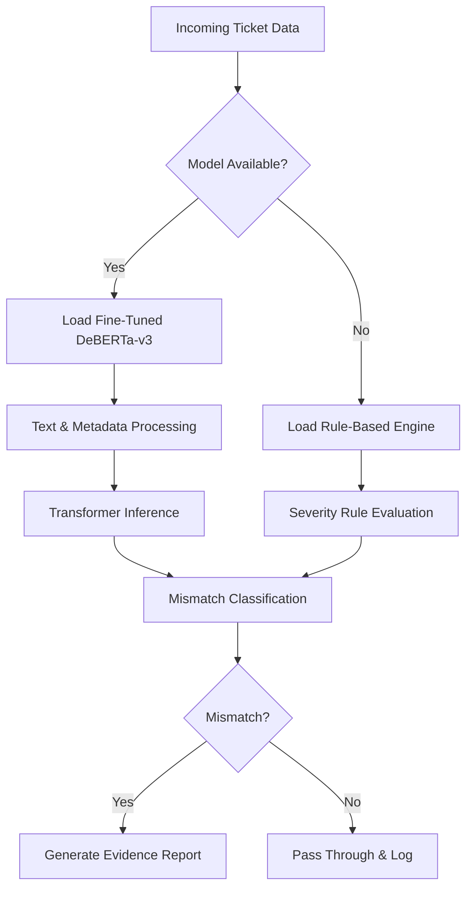

# Support Integrity Auditor (SIA) 🛡️

## Project Overview

The Support Integrity Auditor (SIA) is an AI-powered system designed to identify inconsistencies between the urgency implied by a support ticket's content and its assigned operational priority. By combining structured metadata with unstructured textual signals, SIA helps uncover both **Hidden Crises** (high-impact issues assigned a low priority) and **False Alarms** (low-impact issues escalated unnecessarily), improving triage accuracy and response efficiency.

---

## Methodology: Hybrid Agreement-Based Pseudo-Labeling

Because manually labeled mismatch datasets are rarely available, SIA uses a **Hybrid Agreement-Based Pseudo-Labeling Framework** to generate training labels automatically.

### Signal 1: Linguistic Severity Assessment

The ticket description is analyzed using a domain-specific severity lexicon containing operational, security, compliance, and service-impact indicators (e.g., *outage*, *data loss*, *security incident*, *production failure*). Context-aware checks reduce false triggers caused by negations or hypothetical statements.

### Signal 2: Operational Priority Assessment

The assigned ticket priority from the support platform serves as a structured representation of human triage decisions.

A ticket is pseudo-labeled as a **Priority Mismatch** when the inferred textual severity differs substantially from the assigned operational priority. Tickets exhibiting strong alignment between both signals are labeled as **Consistent** and used as high-confidence training examples.

---

## Inference Pipeline Architecture

The production pipeline utilizes a fine-tuned DeBERTa-v3-small model for real-time mismatch detection. To maintain reliability in environments where the trained model is unavailable, the system automatically falls back to a lightweight rule-based engine without interrupting workflow execution.

## Model Evaluation & Ablation Study

An ablation study was performed to evaluate the contribution of textual understanding and structured metadata signals.

| Model / Feature Set             | Accuracy | Macro F1 | Recall (Mismatch Class) |
| ------------------------------- | -------- | -------- | ----------------------- |
| **DeBERTa (Full Pipeline)**     | **0.92** | **0.91** | **0.89**                |
| DeBERTa (Text Only)             | 0.86     | 0.84     | 0.80                    |
| BoW Baseline + Metadata         | 0.79     | 0.77     | 0.73                    |
| Rule-Based Heuristic (Fallback) | 0.71     | 0.68     | 0.61                    |

### Final Metric Results

The fine-tuned DeBERTa-v3 model demonstrates strong performance on the validation dataset, achieving a **Macro F1 Score of 0.91** and an **overall Accuracy of 92%**. Results from the ablation study indicate that combining textual severity cues with operational metadata significantly improves mismatch detection compared to text-only and rule-based approaches. These findings suggest that agreement-derived pseudo-labels provide a viable foundation for training robust ticket auditing models while minimizing the need for costly manual annotation.
