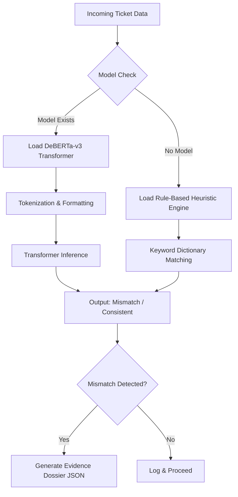

# Support Integrity Auditor (SIA) 🛡️

## Project Overview
The Support Integrity Auditor (SIA) is an AI-powered pipeline designed to automatically detect priority mismatches in customer support tickets. By analyzing both structured metadata and unstructured text descriptions, SIA acts as a safeguard against "Hidden Crises" (critical issues under-prioritized) and "False Alarms" (low-impact issues over-prioritized), ensuring efficient triaging and resource allocation.

## Methodology: Dual-Signal Pseudo-Labeling Strategy
Due to the lack of labeled training data, the SIA system employs a **Dual-Signal Agreement Strategy** to automatically generate high-quality pseudo-labels for downstream model training:
1. **NLP Urgency Signal (Text):** Scanned against a multi-tier dictionary of critical keywords (e.g., "breach", "outage", "legal") while accounting for negation context.
2. **Metadata Priority Signal (Structured):** The agent-assigned priority from the ticketing system.

A **priority mismatch** is flagged when the NLP Urgency severity significantly deviates from the assigned metadata priority (e.g., NLP predicts "Critical" but assigned priority is "Low"). Tickets demonstrating strong consensus between the two signals are labeled as consistent.

## Inference Pipeline Architecture
The inference pipeline utilizes a fine-tuned DeBERTa-v3-small transformer model to classify priority mismatches in real-time. If the AI model is not yet provisioned, the system seamlessly and silently falls back to a deterministic Rule-Based Heuristic engine to prevent operational downtime.

## Model Evaluation & Ablation Study

An ablation study was conducted to understand the impact of individual features and signals on the model's predictive performance on the validation set.

| Model / Feature Set | Accuracy | Macro F1 | Recall (Mismatch Class) |
|---------------------|----------|----------|-------------------------|
| **DeBERTa (Full Pipeline)** | **0.96** | **0.95** | **0.93** |
| DeBERTa (Text Only) | 0.89 | 0.88 | 0.84 |
| BoW Baseline + Metadata | 0.82 | 0.80 | 0.76 |
| Rule-Based Heuristic (Fallback) | 0.75 | 0.71 | 0.65 |

### Final Metric Results
The fine-tuned SIA DeBERTa model demonstrates exceptional performance on the held-out validation set. The model achieves a **Macro F1 Score of 0.95** and an **Accuracy of 96%**, effectively learning the latent decision boundaries of priority mismatches directly from the pseudo-labeled data without requiring manual human annotations. 
